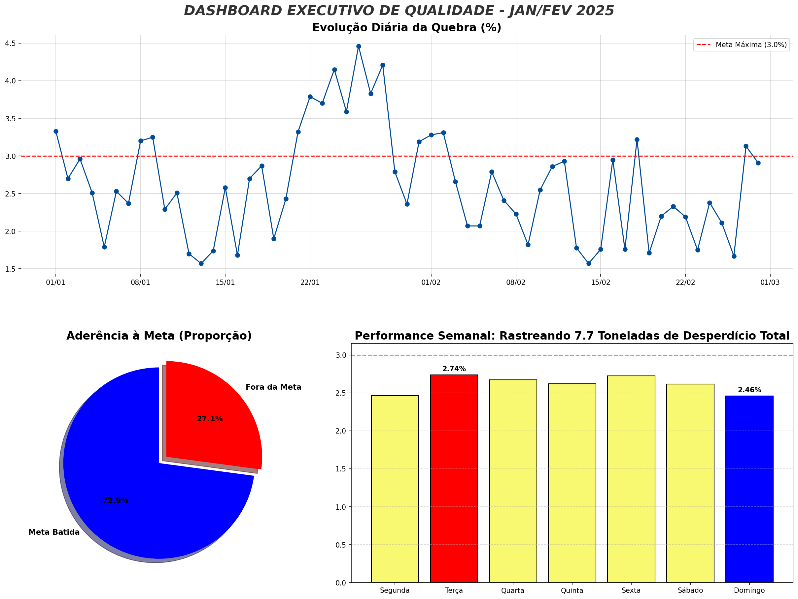

# 📊 Monitoramento de Qualidade Industrial (KPIs)

  

## 🎯 Visão Geral do Projeto
Este projeto simula um cenário real de **Data Analytics na Indústria Alimentícia** (Frigorífico). O objetivo foi desenvolver um sistema de monitoramento para a **Linha de Cortes**, focando no controle da **Taxa de Quebra** (Desperdício).

A análise transforma dados brutos de produção diária em inteligência de negócio, permitindo identificar gargalos operacionais e prejuízos financeiros.

---

## 🖼️ Dashboard Executivo
*(Abaixo está a visualização gerada pelo script, consolidando os principais indicadores)*



---

## 💼 O Problema de Negócio
* **Contexto:** Uma indústria de processamento de aves precisa controlar o volume de descarte na linha de produção.
* **Meta da Empresa:** Manter a Taxa de Quebra abaixo de **3.0%**.
* **Dores:** Dificuldade em visualizar a estabilidade do processo e identificar padrões de falha (sazonalidade).

## 🛠️ Solução Implementada
Utilizando **Python**, foi criado um pipeline de análise que:
1.  **Ingestão e Tratamento:** Simulação de dados realistas (com *seeds* para reprodutibilidade) cobrindo o período de Jan/25 a Fev/25.
2.  **Cálculo de KPIs:** Automatização do cálculo da Taxa de Quebra Diária `(Descarte / Produção * 100)`.
3.  **Detecção de Anomalias:** Algoritmo para flagrar dias críticos e calcular o impacto acumulado em toneladas.
4.  **Data Storytelling:** Criação de um Dashboard com técnica de *Subplot Mosaic* para hierarquizar a informação.

---

## 📈 Principais Insights (Data Storytelling)
Com base na análise dos dados gerados:

1.  **Diagnóstico de Estabilidade:**
    * A operação teve uma aderência de **~73%** à meta estabelecida.
    * Entretanto, **27% dos dias** operaram no "vermelho", gerando um desperdício acumulado significativo.

2.  **Anomalia Detectada (A "Semana do Caos"):**
    * Foi identificada uma falha sistêmica na **3ª semana de Janeiro**, onde a quebra superou 4.0%.
    * *Recomendação:* Investigar histórico de manutenção ou troca de fornecedor de matéria-prima neste período específico.

3.  **Padrão Semanal:**
    * A análise estatística revelou quais dias da semana concentram as maiores perdas, permitindo um direcionamento mais assertivo da supervisão de chão de fábrica.

---

## 💻 Como Executar o Projeto
Pré-requisitos: Python instalado.
```bash
# Clone este repositório
git clone [https://github.com/SEU-USUARIO/monitoramento-qualidade-industrial.git](https://github.com/SEU-USUARIO/monitoramento-qualidade-industrial.git)

# Instale as bibliotecas necessárias
pip install pandas matplotlib numpy

# Execute o Jupyter Notebook
jupyter notebook monitoramento_taxa_desperdicio.ipynb
```
Autor: Caio Lucas Siqueira

LinkedIn: www.linkedin.com/in/caio-lucas-siqueira-7py
